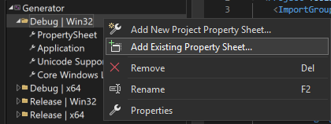

# 二维码生成器
此项目是一个基于[zint库](https://zint.org.uk/manual/chapter/1)的二维码生成器。它可以批量生成一组二维码，并支持自定义内容和输出格式，适用于需要高效生成二维码的场景

## 运行之前
1. 配置zint库到Visual Studio中：
    1. 打开`PropertySheet.props`文件
    2. 将其中的`<ZintDir>`部分更改为你本地的zint库路径，并保存
    3. 打开Visual Studio的属性管理器，在含有Win32平台的属性上右击，选择添加属性表`PropertySheet.props`即可
    4. 选择x86/Win32平台进行编译，此时会提示运行失败：找不到`zint.dll`
    5. 在`<ZintDir>\win32\Release`或者`<ZintDir>\win32\Debug`目录下找到`zint.dll`，复制到本项目的`./Debug`或者`./Release`目录下（此操作旨在将`zint.dll`与`Generator.exe`置于同一目录）。

2. `main.cpp`: 该文件为程序的主入口，可以在此编程，通过修改`msgs`变量的值以改变输出的二维码对应的加密内容。代码文件首部还有其他常量可以修改，目前支持的有：
```cpp
// 二维码保存目录
static const string save_root = "./fruits/";
// 文件保存扩展名
static const string file_postfix = ".bmp";
// 二维码缩放比例
static const float scale = 1;
// 二维码编码模式
static const int mode = BARCODE_QRCODE;
```
更多编码模式请参考Zint的[官方文档](https://zint.org.uk/manual/chapter/6/1)。